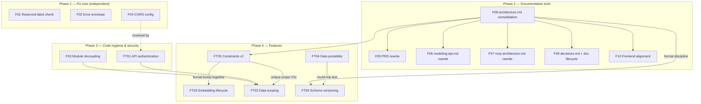

# Architecture Review — July 2026

> Code-vs-docs consistency review of OntoForge at v2.3.1, plus a proposed feature roadmap.
> Each finding (F) and feature concept (FT) is an isolated, independently actionable document.
> **Everything here is a proposal** — per project rules, each architectural decision needs
> explicit user approval before implementation.

## The One-Paragraph Diagnosis

The code is healthy and ahead of the documentation. OntoForge pivoted from "an ontology owns its
schema" to "ontologies are lenses over a global schema" and then shipped four major subsystems
(semantic search, Cypher queries, saved-query pipelines, AI runtime with A2A) — but the
documentation set split into two families along the way. `README.md`, the code, and the
`feature-ideas/` folder describe the **new** world; `prd.md`, `api-contracts/modeling-api.md`,
`mcp-architecture.md`, and `decisions.md` still describe the **old** one. The most accurate specs
in the repo currently live in the ideas folder marked "Status: Implemented", while the documents
of record are stale — the exact inversion of the repo's own lifecycle rule (PRD → Architecture →
Code). Only three genuine code defects were found (F01, F02, F03); everything else is
documentation debt and process drift.

## Findings (Corrections)

| ID | Title | Severity | Effort | Type |
|----|-------|----------|--------|------|
| [F01](findings/F01-reserved-label-check-missing.md) | Reserved-label collision check documented but not implemented | High | S | Code bug |
| [F02](findings/F02-error-envelope-gap.md) | Request validation errors bypass the error envelope | Medium | S | Code bug |
| [F03](findings/F03-module-coupling.md) | Modeling→runtime coupling exceeds documented boundary | Medium | M | Refactor |
| [F04](findings/F04-mcp-security-surface.md) | Unauthenticated global modeling MCP, CORS `*` | High | S–M | Hardening |
| [F05](findings/F05-prd-realignment.md) | PRD describes the pre-lens product model | High | M | Doc rewrite |
| [F06](findings/F06-modeling-api-contract.md) | modeling-api.md documents an API that no longer exists | High | M | Doc rewrite |
| [F07](findings/F07-mcp-architecture-doc.md) | mcp-architecture.md describes the pre-lens modeling MCP | High | M | Doc rewrite |
| [F08](findings/F08-architecture-doc-consolidation.md) | architecture.md missing whole shipped subsystems | High | L | Doc consolidation |
| [F09](findings/F09-decision-log-and-doc-lifecycle.md) | Decision log frozen at 007; shipped features live in ideas folder | Medium | S–M | Process |
| [F10](findings/F10-frontend-alignment.md) | Frontend doc drift + two small frontend gaps | Medium | S–M | Doc + code |

## Feature Concepts (Recommendations)

| ID | Title | Priority | Effort |
|----|-------|----------|--------|
| [FT01](features/FT01-api-authentication.md) | Optional API authentication | High | S |
| [FT02](features/FT02-data-scoping.md) | Data scoping (scope dimensions) | Medium-High | L |
| [FT03](features/FT03-embedding-lifecycle.md) | Embedding lifecycle management | Medium | M |
| [FT04](features/FT04-data-portability.md) | Complete data portability (instance import) | Medium | M |
| [FT05](features/FT05-schema-constraints-v2.md) | Schema expressiveness v2 (enums, cardinality, unique) | Medium-High | L |
| [FT06](features/FT06-schema-versioning.md) | Schema versioning & change safety | Lower | L |

## Dependency Overview

Key edges in words:

- **F08 (architecture.md) unblocks everything documentary** — it is the anchor the other doc
  rewrites (F05–F07, F09, F10) reference, and the contract features extend.
- **FT01 (auth) gates FT02 (data scoping)** — scope headers without auth are isolation, not
  security. F04 is resolved by FT01 plus a small CORS change.
- **FT05 and FT03 both extend PropertyDefinition** and should coordinate a single export-format
  bump; FT05's uniqueness increment (V2c) is a building block for FT02's dimension keys.
- **F01–F03 are independent** of everything and each other; F03 should simply land before new
  features add more cross-module imports.

## Recommended Order

1. **Immediately (small, high value):** F01 (real bug in a core invariant), F02, CORS part of
   F04. Each is one small PR.
2. **Documentation consolidation sprint:** F08 first, then F06 + F07 (the two contracts external
   consumers read), then F05 (PRD), F09 (decision backfill + move implemented docs out of
   feature-ideas), F10 (frontend doc + the two small code fixes). This clears the "STOP on
   inconsistency" landmines for all future AI-assisted sessions — arguably the highest-leverage
   work in this list for a project developed the way this one is.
3. **F03 module decoupling** — one mechanical PR while no feature work is in flight.
4. **FT01 authentication** — small, unlocks shared deployments, closes F04.
5. **Feature wave:** FT05 (enums first), FT03, FT04 in any order; then **FT02 data scoping** on
   top of FT01 + FT05-V2c; **FT06** direction decided now, Stage 1 (impact dry-run) optionally
   pulled forward, later stages only with real external consumers.

## Method

Four parallel audits (backend vs architecture, MCP vs docs, frontend vs docs, docs vs docs) over
the full repository at commit `1a4c862`, findings verified against code with file-level evidence.
Severities reflect impact on the project's stated goals (consistency-first documentation,
schema-enforced writes, AI-agent integration), not code style.
